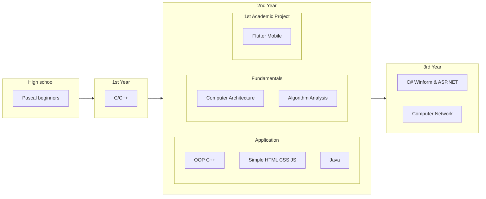

### Languages: Vietnamese &#127483;&#127475; / English &#127482;&#127480; / ~~Japanese next~~ &#127471;&#127477;
# Yes, I am a Nguyen&trade; 
## My backgrounds
I started as a ***hobbyist illustrator*** before learning to code my first serious C++ school project in university

*I still talk more of UI/UX than performance, a GUI person ~~sorry~~*

### My journey has been something like this:

